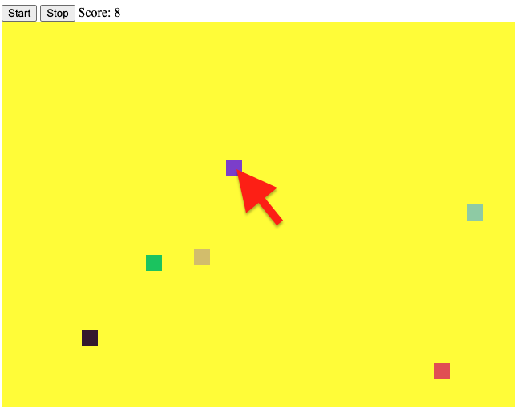

# Simple pixel mini-game

Here is a supper simple and funny game has written on Canvas. The game itself has start and stop buttons and the scored counter which preset to user how many colorful squares were caught.

## Getting Started

Just, run file below on any brawser:

```bash
index.html
```



Use HTML + JavaScript + Canvas
